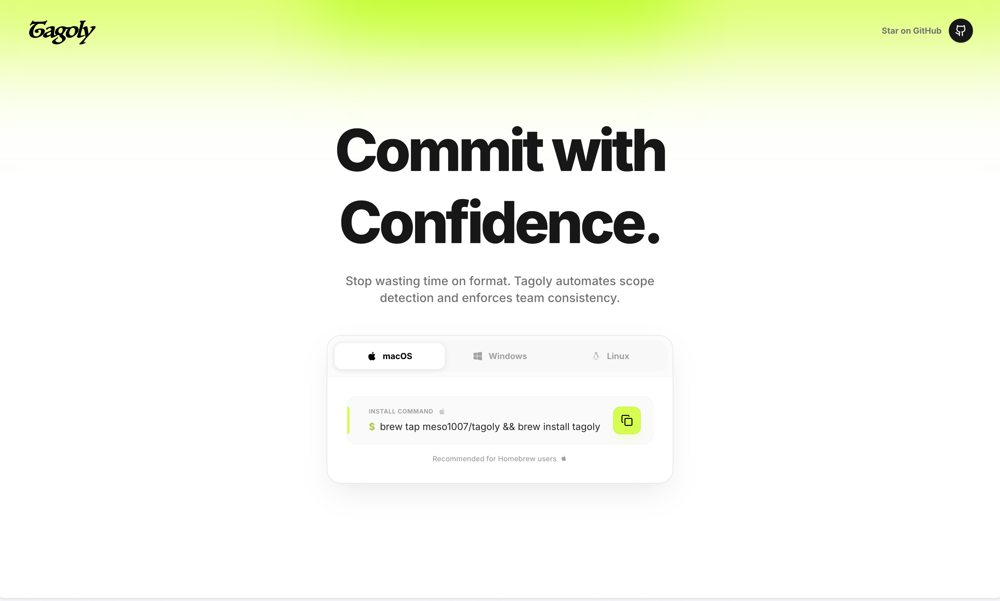

<p align="center">
  
</p>

# Tagoly LP

Landing page for Tagoly, built with Next.js App Router.

- Live : [https://www.tagoly-lp.us/](https://www.tagoly-lp.us/)

## Top Page Preview



> `public/top-page-screenshot.svg` is a placeholder preview image.  
> Replace it with an actual screenshot file (same path) whenever you want.

## Skill Stack (Detailed)

| Category | Technology | Purpose | Notes |
| --- | --- | --- | --- |
| Framework | Next.js 16 (App Router) | Routing, rendering, metadata API | Static routes for `robots.txt` and `sitemap.xml` |
| UI Library | React 19 | Component-based UI | Client components for animated sections |
| Language | TypeScript | Type safety and maintainability | Better DX for component props and metadata typing |
| Styling | Tailwind CSS 4 | Utility-first styling | Fast iteration for landing page sections |
| Animation | Framer Motion | Intro and section transitions | Smooth hero/overlay interactions |
| Linting | ESLint | Code quality checks | Run via `bun run lint` |
| Runtime | Bun | Local development and build | Works with `bun run dev/build/start` |

## SEO Checklist

| Item | File | Status | Description |
| --- | --- | --- | --- |
| Metadata | `src/app/layout.tsx` | Implemented | Title, description, canonical, robots, Open Graph, Twitter |
| Structured Data | `src/app/layout.tsx` | Implemented | JSON-LD for `WebSite` and `SoftwareApplication` |
| Robots | `src/app/robots.ts` | Implemented | Generates `/robots.txt` dynamically |
| Sitemap | `src/app/sitemap.ts` | Implemented | Generates `/sitemap.xml` dynamically |
| OG Image | `src/app/opengraph-image.tsx` | Implemented | Dynamic social share image |
| App Icon | `src/app/icon.tsx` | Implemented | Dynamic icon generation |

## Local Development

```bash
bun install
bun run dev
```

Open [http://localhost:3000](http://localhost:3000).

## Scripts

| Command | Description |
| --- | --- |
| `bun run dev` | Start development server |
| `bun run build` | Create production build |
| `bun run start` | Start production server |
| `bun run lint` | Run ESLint |

## Project Structure

| Path | Purpose |
| --- | --- |
| `src/app` | App Router pages, layout, and SEO routes |
| `src/components` | Reusable UI and landing page sections |
| `src/lib` | Shared utilities (e.g. site URL resolver) |

## Deployment

Deploy on Vercel or any platform that supports Next.js.
